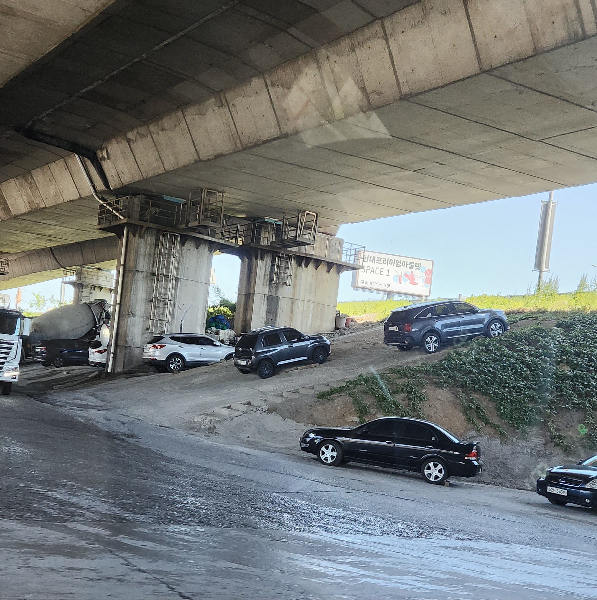
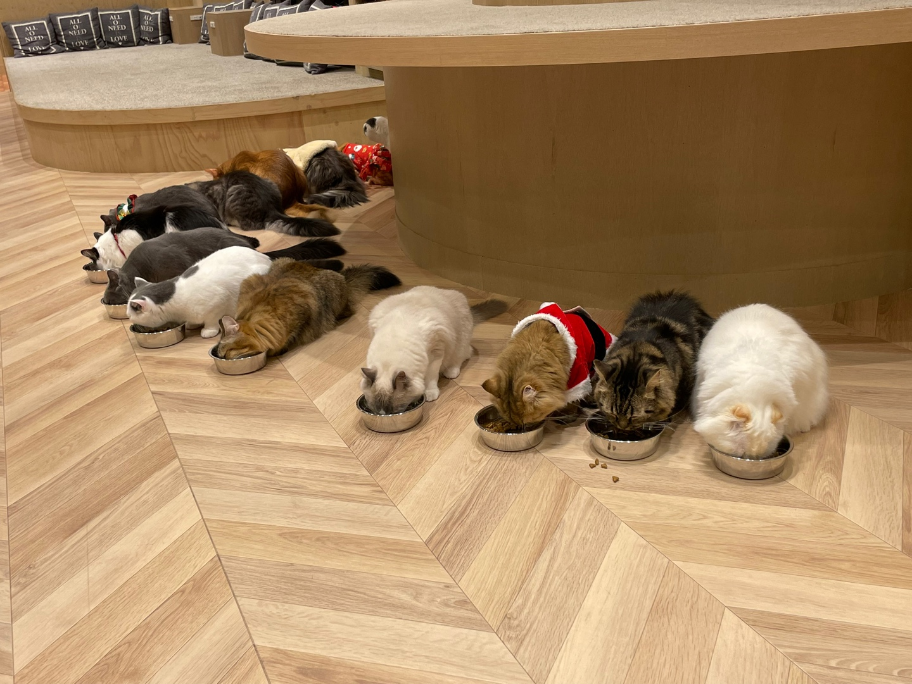

# 201935070 Shin Hyeon Ho - 소프트웨어학과

## 프로젝트 개요
이 프로젝트는 **YOLO (You Only Look Once)** 알고리즘을 사용하여 이미지를 분석하고, 이미지 내 객체를 탐지하는 프로그램입니다. 주로 자동차, 고양이, 우주 이미지와 같은 다양한 객체를 인식할 수 있습니다. OpenCV와 YOLO를 사용하여 객체를 탐지하고, 해당 객체의 위치에 사각형을 그려 결과를 표시합니다.

## 데모나 예시
프로젝트의 실행 결과는 다음과 같은 이미지에서 객체를 탐지하는 과정을 보여줍니다:

- **자동차 이미지 (cars.jpg)**  
  

- **고양이 이미지 (cats.jpg)**  
  

- **우주 이미지 (space.jpg)**  
  

## 사용한 패키지와 버전
이 프로젝트에서는 다음과 같은 패키지를 사용했습니다:

- **OpenCV**: `4.5.3.56`
- **NumPy**: `1.20.1`

### 설치
프로젝트를 실행하려면 먼저 필요한 패키지를 설치해야 합니다. 아래 명령어를 사용하여 필요한 패키지를 설치할 수 있습니다:

```bash
pip install opencv-python numpy


## 실행 방법
1. **이미지 준비**: `cars.jpg`, `cats.jpg`, `space.jpg` 이미지를 프로젝트 디렉토리에 넣습니다.
2. **YOLO 모델 파일 준비**: `yolov3.cfg`, `yolov3.weights`, `coco.names` 파일을 프로젝트 디렉토리에 준비합니다.
3. **코드 실행**: 아래 명령어로 코드를 실행하여 이미지에서 객체를 탐지합니다.

```bash
python read_image.py
4. **결과 확인**: 결과는 이미지에 탐지된 객체를 표시한 후, 별도의 창에서 확인할 수 있습니다.


##참고 자료
https://github.com/AlexeyAB/darknet
https://pyimagesearch.com/
